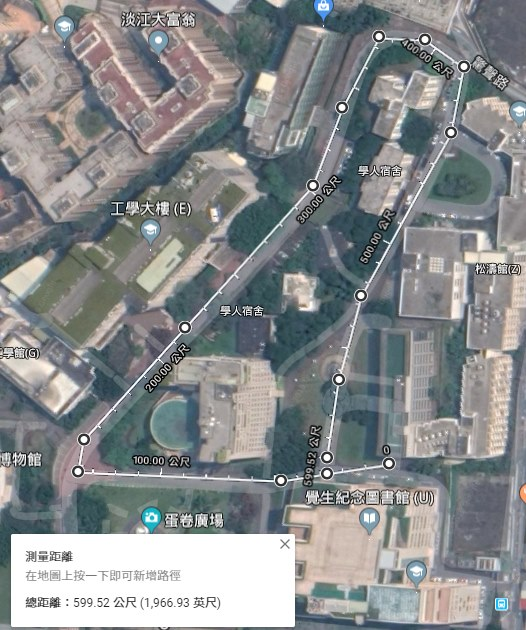
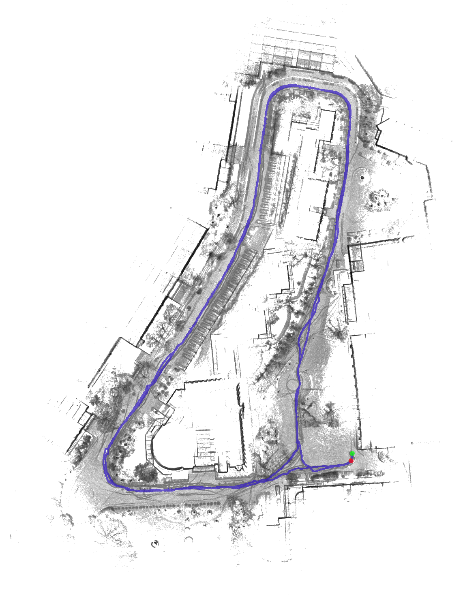

## cartographer_vlp16-imu_config
  vlp16 + imu(fsm-9)的3d建圖測試  
  總之 跟cartographer放在一起編譯  
## map
  * [淡江大學](https://www.google.com.tw/maps/@25.1752379,121.4520693,307a,35y,38.72h,0.56t/data=!3m1!1e3?hl=zh-TW&authuser=0)  
  
## bagfile
  [2019-12-18-13-37-34.bag](https://drive.google.com/open?id=1YJY3EXCXTad67RsgrSPB3GPyhsPsDDoH)  
  [其他資料](https://drive.google.com/open?id=1uZAqH_6JQV0LuT0MIumaLouNN_BezRu7)

## 建置
```bash
$ catkin_make_isolated --install --use-ninja
$ source install_isolated/setup.bash
```
## demo
```bash
# 模擬online邊走邊建置地圖,如果移動過快,導致計算跟不上,可能會建置失敗
$ roslaunch cartographer_vlp16-imu_config demo_vlp16-imu.launch bag_filenames:=${HOME}/Downloads/2019-12-18-13-37-34.bag
```
## offline
```bash
# 當計算完才會跑下一筆資料
$ roslaunch cartographer_vlp16-imu_config offline_vlp16-imu.launch bag_filenames:=${HOME}/Downloads/2019-12-18-13-37-34.bag
```
  跑完後會產生2019-12-18-13-37-34.bag.pbstream,用於後續產生點雲圖與2d地圖  
  也可以在程式執行中輸入以下命令,直接產生pbstream檔案

```bash
# Finish the first trajectory. No further data will be accepted on it.
$ rosservice call /finish_trajectory 0

# Ask Cartographer to serialize its current state.
# (press tab to quickly expand the parameter syntax)
$ rosservice call /write_state "{filename: '${HOME}/Downloads/2019-12-18-13-37-34.bag.pbstream', include_unfinished_submaps: 'true'}"
  ```
## assets writer

```bash
$ roslaunch cartographer_vlp16-imu_config  assets_writer_vlp16-imu.launch \
 bag_filenames:=${HOME}/Downloads/2019-12-18-13-37-34.bag \
 pose_graph_filename:=${HOME}/Downloads/2019-12-18-13-37-34.bag.pbstream
```
  執行完就會跑出ply與2d地圖
  * 結果
  
## 其他
  * 因為cartographer使用protobuf3, gazebo使用protobuf2,可以把cartographer的刪掉

```
$ rm -rf protobuf/
$ catkin_make_isolated --install --use-ninja
```
  * 不建議使用Google的point_cloud_viewer,編譯複雜且不易使用
    * ply->CloudCompare
    * pcd->pcl_viewer
  * 如果想使用point_cloud_viewer記得assets_writer_vlp16-imu.lua裡面action = "intensity_to_color"必須啟用
  * [point_cloud_viewer測試data](https://drive.google.com/open?id=1C0t5CvQe9_vkzOr6VeUNSCrNQ6zvogUT)
  
  * 如果不想要在輸出的地圖顯示路徑,將assets_writer_vlp16-imu.lua裡面draw_trajectories = true,改為false
  * 舊版本測試
    * [來源](https://github.com/googlecartographer/cartographer_ros/issues/259)
    * [bagfile](https://drive.google.com/file/d/0B1k3ck5GxxM7V1pwNmVUUUFudE0/view)
    * [carographer30b9fcce34](https://github.com/googlecartographer/cartographer/tree/30b9fcce349aef816b5b484a0b5ba112760e68f4?fbclid=IwAR27WOYDcVBAV_wKSnVrm6Wlc-DlaeLEFiygiRHeRmaowcGJcMvqI6uXHoE)
    * [cartographer_ros-user-ozgudum](https://github.com/SirVer/cartographer_ros/tree/user/ozgudum?fbclid=IwAR0Q9GTmnmYkkMCB54PPudyOggNbxYQs_smBl8O808TnLFm4CFdZe-UR3OE)
    * [測試資料](https://drive.google.com/open?id=1yZdbekNmNkPBytlXquzZTz28PQBtAETj)
  * 其他測試bag
    * [cartographer_kitti_config](https://github.com/inkyusa/cartographer_kitti_config)
## 參考
  * [Cartographer ROS Integration](https://google-cartographer-ros.readthedocs.io/en/latest/)
  * [TurtleBot3 SLAM](http://emanual.robotis.com/docs/en/platform/turtlebot3/slam/)
